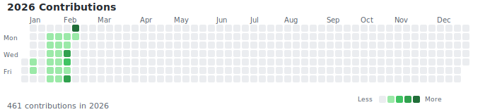

# **ObsidianFlow** 

<p align="center">
  
  
  
  
  
  
</p>

<!-- STATS START -->
<p align="center">
  
  
  
</p>
<p align="center">
  
</p>

<!-- STATS END -->

<div align="center">

[](https://github.com/CrRdz/ObsidianRemoteRepository/actions/workflows/WeeklyReviewGenerator.yml)
[](https://github.com/CrRdz/ObsidianRemoteRepository/actions/workflows/DailyReviewGenerator.yml)

</div>

---

## 目录

- [核心特性](#核心特性)
- [仓库结构](#仓库结构)
- [自动化工作流](#自动化工作流)
- [快速开始](#快速开始)
- [同步策略](#同步策略)
- [技术栈](#技术栈)

---

## 核心特性

| 特性 | 说明 |
|------|------|
| **跨设备同步** | Windows/macOS 无缝同步，基于 Obsidian Git 插件 |
| **AI 智能报告** | 自动生成日报/周报，使用 DeepSeek AI |
| **动态仪表盘** | 实时统计笔记数量、字数、活跃度热力图 |
| **配置模板化** | Template 分支自动同步 Obsidian 配置 |
| **全自动化** | 提交/同步/统计全由 GitHub Actions 完成 |

---

## 仓库结构

### 推荐的目录结构

```
ObsidianRemoteRepository/
├── .github/
│   ├── workflows/
│   │   ├── AutoSyncConfig.yml          # 配置同步到 template 分支
│   │   ├── UpdateDashboard.yml         # 统计数据更新
│   │   ├── DailyReviewGenerator.yml    # AI 日报生成
│   │   └── WeeklyReviewGenerator.yml   # AI 周报生成
│   └── scripts/
│       ├── update_stats.py             # 统计脚本
│       ├── generate_daily_review.py    # 日报生成脚本
│       └── generate_weekly_review.py   # 周报生成脚本
│
├── .obsidian/
│   ├── plugins/                        # 社区插件
│   ├── themes/                         # 主题
│   ├── app.json                        # 应用配置
│   ├── appearance.json                 # 外观配置
│   ├── core-plugins.json               # 核心插件
│   └── community-plugins.json          # 社区插件列表
│
├── Assets/
│   ├── heatmap.svg                     # 自动生成的贡献热力图
│   └── images/                         # 笔记中的图片资源
│
├── Reviews/
│   ├── Daily/
│   │   └── Daily-YYYY-MM-DD.md        # AI 生成的日报
│   └── Weekly/
│       └── Weekly-Review-YYYY-W##.md  # AI 生成的周报
│
├── Notes/                              # 你的笔记目录（可自定义）
│   ├── Inbox/                          # 待整理笔记
│   ├── Projects/                       # 项目笔记
│   ├── Reference/                      # 参考资料
│   └── Archive/                        # 归档笔记
│
├── .gitignore
├── LICENSE
└── Readme.md
```

### 分支结构

```
master (主分支 - 完整笔记库)
├── 所有 Markdown 笔记
├── .obsidian/ 配置
├── .github/ 工作流
├── Assets/ 资源
└── Reviews/ AI 报告

template (模板分支 - 仅配置)
├── .obsidian/ 配置
├── Readme.md
├── LICENSE
├── Assets/
└── .gitignore (排除 *.md)
```

**分支用途：**
- `master`: 完整的笔记库，包含所有内容
- `template`: 干净的配置模板，用于新设备初始化

---

## 自动化工作流

本项目包含 4 个自动化工作流，覆盖知识管理的完整生命周期：

### 1. Update Knowledge Dashboard

**触发条件：**
- 每次 Markdown 文件推送到 master 分支
- 每天定时运行（UTC 00:00）
- 手动触发

**功能：**
- 统计笔记总数、总字数
- 生成 2026 年度贡献热力图（SVG）
- 自动更新 README 中的统计徽章
- 同步更新到 template 分支

**实现细节：**
```yaml
on:
  push:
    branches: [master]
    paths: ['**.md']
  schedule:
    - cron: '0 0 * * *'
  workflow_dispatch:
```

---

### 2. Daily Review Generator

**触发条件：**
- 手动触发（可选择日期或几天前）

**功能：**
- 基于当天笔记内容生成 AI 日报
- 提取学习主题和关键词
- 自动创建 Pull Request 供审阅
- 支持 YYYY-MM-DD 日期选择或相对天数（昨天/今天/7天前）

**输入参数：**
- `target_date`: 生成日报的日期（格式: YYYY-MM-DD）
- `days_ago`: 或选择几天前（0=今天, 1=昨天）

**生成的 PR 包含：**
- 日期和文件路径
- 使用的 AI 模型信息
- 生成时间（北京时区）
- 提取的主题列表

---

### 3. Weekly Review Generator

**触发条件：**
- 每周日 UTC 15:00（北京时间 23:00）自动运行
- 手动触发

**功能：**
- 汇总本周学习内容
- 生成结构化周报（格式: Weekly-Review-YYYY-W##.md）
- 自动创建 PR 包含：
  - 合并前检查清单
  - 在线编辑指南
  - 合并方式建议

**PR 审阅检查项：**
- 周报内容准确无误
- 格式排版正常
- 专业术语使用正确
- 没有敏感信息

---

### 4. Sync Config to Template Branch

**触发条件：**
- `.obsidian/` 配置变更
- `Readme.md` / `LICENSE` / `Assets/` 更新
- 手动触发

**功能：**
- 将 Obsidian 配置同步到独立的 `template` 分支
- 自动生成动态 Commit Message（标明变更文件）
- 为新设备提供干净的配置模板
- 排除笔记内容（通过 `.gitignore`）

**同步内容：**
- `.obsidian/` - 所有 Obsidian 配置
- `Readme.md` - 项目说明
- `LICENSE` - 许可证
- `Assets/` - 资源文件（图片、热力图等）

---

## 快速开始

### 新设备初始化流程

#### 1. 准备环境

- 安装 [Git](https://git-scm.com/)
- 安装 [Obsidian](https://obsidian.md/)

#### 2. 克隆仓库

**选项 A: 完整笔记库（包含所有笔记）**
```bash
git clone https://github.com/CrRdz/ObsidianRemoteRepository.git
cd ObsidianRemoteRepository
```

**选项 B: 纯净模板（仅配置文件）**
```bash
git clone -b template https://github.com/CrRdz/ObsidianRemoteRepository.git
cd ObsidianRemoteRepository
git checkout -b master
git branch -u origin/master
```

#### 3. 配置 Obsidian

1. 打开 Obsidian
2. 选择 "Open folder as vault"
3. 选择刚克隆的文件夹
4. 插件会自动加载（来自 `.obsidian/` 配置）

#### 4. 启用 Obsidian Git 插件

进入 Settings → Community plugins → Obsidian Git

**推荐配置：**
- Auto pull on startup: 启用
- Auto backup after file change: 启用
- Auto backup interval: 10 分钟
- Pull updates on startup: 启用

---

## 工作流程图

### 日常使用流程

```
编辑笔记
    ↓
10分钟自动同步
    ↓
Git 插件自动提交
    ↓
触发 GitHub Actions
    ├── 更新统计数据
    ├── 同步配置到 template
    └── 更新 README 徽章
```

### 周报生成流程

```
每周日 23:00 (北京时间)
    ↓
扫描本周新增/修改的笔记
    ↓
调用 DeepSeek AI 生成周报
    ↓
创建 Pull Request
    ↓
人工审阅 & 编辑
    ↓
合并到 master 分支
```

### 配置同步机制

```
修改 .obsidian/ 配置
    ↓
推送到 master 分支
    ↓
触发 AutoSyncConfig workflow
    ↓
├── 切换到 template 分支
├── 复制配置文件
├── 生成 .gitignore
└── Force push 到 template
```

---

## 同步策略

### 核心原则

1. **初始化阶段**：使用命令行（CLI）进行仓库克隆
2. **日常使用**：完全依赖 Obsidian Git 插件自动化管理
3. **同步频率**：10分钟无操作自动同步 + 启动时自动拉取
4. **冲突处理**：避免同时多设备编辑同一文档
5. **配置隔离**：本地状态文件不纳入版本控制

### 文件管理规则

**纳入版本控制：**
- 所有 Markdown 笔记（`*.md`）
- Obsidian 配置（`.obsidian/`）
- 资源文件（`Assets/`）
- 工作流脚本（`.github/`）

**排除版本控制：**
- 本地缓存（`.obsidian/workspace.json`）
- 插件数据（`.obsidian/plugins/*/data.json`）
- 临时文件（`.DS_Store`, `Thumbs.db`）

---

## 技术栈

| 组件 | 用途 |
|------|------|
| **Obsidian** | Markdown 笔记编辑器 |
| **Obsidian Git** | 自动 Git 同步插件 |
| **GitHub Actions** | CI/CD 自动化 |
| **DeepSeek AI** | LLM 驱动的报告生成 |
| **Python** | 统计脚本 + AI 交互 |

---
<p align="center">
  Created by <a href="https://github.com/CrRdz">CrRdz</a>
</p>
